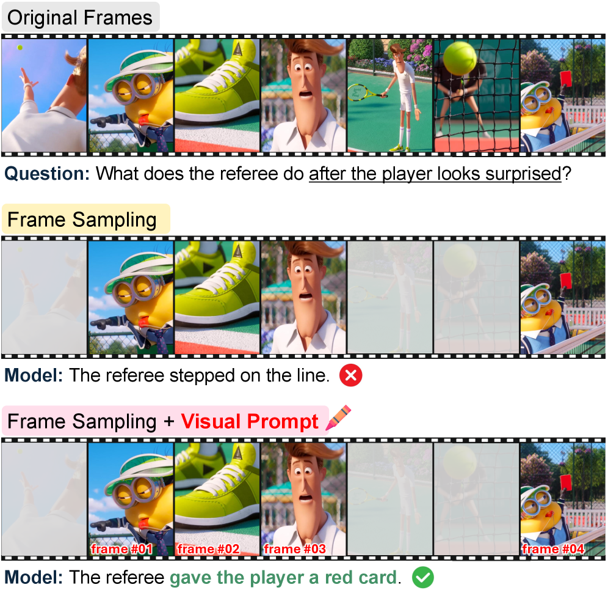
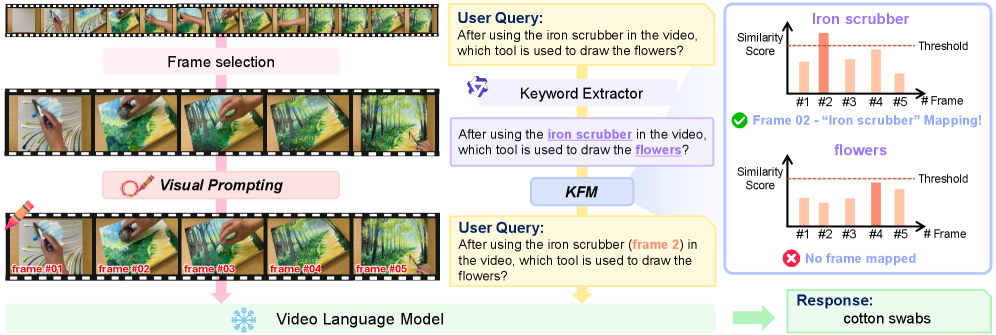

<p align="center">
  <h1 align="center">ViKey: Enhancing Temporal Understanding in Videos via Visual Prompting</h1>
  <h3 align="center"><b>CVPR 2026</b></h3>
  <p align="center">
    <h4 align="center">
      <a href="https://dusruddl2.github.io/"><strong>Yeonkyung Lee*</strong></a> ·
      <a href="https://jdy77.github.io/"><strong>Dayun Ju*</strong></a> ·
      <a href="https://winston1214.github.io/"><strong>Youngmin Kim</strong></a> ·
      <a href="https://seilk.github.io/"><strong>Seil Kang</strong></a> ·
      <a href="https://micv.yonsei.ac.kr/seongjae"><strong>Seong Jae Hwang</strong></a>
    </h4>
    <h4 align="center">
      Yonsei University
    </h4>
    <h6 align="center">*Equal contribution.</h6>
  </p>
  <p align="center">
    <a href="https://arxiv.org/abs/2603.23186"></a>
  </p>
  <br>
</p>

# Abstract

Recent advancements in Video Large Language Models (VideoLLMs) have enabled strong performance across diverse multimodal video tasks. To reduce the high computational cost of processing dense video frames, efficiency-oriented methods such as frame selection have been widely adopted. While effective at minimizing redundancy, these methods often cause notable performance drops on tasks requiring temporal reasoning. Unlike humans, who can infer event progression from sparse visual cues, VideoLLMs frequently misinterpret temporal relations when intermediate frames are omitted. To address this limitation, we explore **visual prompting (VP)** as a lightweight yet effective way to enhance temporal understanding in VideoLLMs. Our analysis reveals that simply annotating each frame with explicit ordinal information helps the model perceive temporal continuity. This visual cue also supports frame-level referencing and mitigates positional ambiguity within a sparsely sampled sequence. Building on these insights, we introduce **ViKey**, a training-free framework that combines VP with a lightweight **Keyword-Frame Mapping (KFM)** module. KFM leverages frame indices as dictionary-like keys to link textual cues to the most relevant frames, providing explicit temporal anchors during inference. Despite its simplicity, our approach substantially improves temporal reasoning and, on some datasets, preserves dense-frame baseline performance with as few as 20% of frames.

<p align="center">

</p>

<br>

# Method

ViKey overlays each cached frame with an explicit ordinal cue (visual prompting) and uses a Keyword-Frame Mapping module to link textual cues to the most relevant frames, providing explicit temporal anchors during inference.

<p align="center">

</p>

<br>

# Install Environment

Our inference code is built on top of the official [LLaVA-NeXT](https://github.com/LLaVA-VL/LLaVA-NeXT) (LLaVA-Video) repository, with [OpenAI CLIP](https://github.com/openai/CLIP) as the Keyword-Frame Mapping backbone and [vLLM](https://github.com/vllm-project/vllm) serving Qwen2.5-7B-Instruct for keyword extraction.

```bash
conda create -n vikey python=3.10 -y
conda activate vikey

# PyTorch -- match your CUDA version
pip install torch==2.1.2 torchvision==0.16.2 --index-url https://download.pytorch.org/whl/cu121

# Python dependencies
pip install -r requirements.txt

# LLaVA-NeXT (LLaVA-Video backbone)
pip install git+https://github.com/LLaVA-VL/LLaVA-NeXT.git

# OpenAI CLIP
pip install git+https://github.com/openai/CLIP.git
```

The following checkpoints are downloaded automatically by Hugging Face on first use:

| Component          | Default checkpoint                |
| ------------------ | --------------------------------- |
| Video-LLM backbone | `lmms-lab/LLaVA-Video-7B-Qwen2`   |
| Keyword extractor  | `Qwen/Qwen2.5-7B-Instruct`        |
| Mapping backbone   | OpenAI CLIP `ViT-L/14`            |

<br>

# Dataset Structure

ViKey runs on **pre-extracted candidate frames** rather than raw video files. Before running ViKey, uniformly sample the candidate frames from each video (typically 32–64 frames) and save them as PNGs under a shared cache directory — this is the directory you pass as `--cache-dir`. Pre-extracting once avoids repeating video decoding for every experiment and lets visual prompts be applied as a one-time pre-processing step.

Cache layout — one sub-directory per video:

```
<cache-dir>/
├── <video_id_without_ext>/
│   ├── frame001_*.png
│   ├── frame002_*.png
│   └── ...
└── ...
```

Each benchmark also expects a JSONL labels file with one question per line (`question`, `options`, ...) — see the official Video-MME, MVBench, LongVideoBench, and TempCompass evaluation kits for the exact schemas.

<br>

# Usage

ViKey is a three-stage pipeline. Run the stages in order:

### Step 1. Visual prompting

Render frame-index captions on every cached frame. Two visual-prompt styles are provided:

```bash
# Background-box style
python add_VP.py \
    --root_dir /path/to/cached_frames \
    --output_dir /path/to/cached_frames_VP \
    --auto-font-div 10

# Outline (stroked-text) style
python add_VP_outline.py \
    --root_dir /path/to/cached_frames \
    --output_dir /path/to/cached_frames_VPoutline \
    --auto-font-div 10
```

### Step 2. Keyword extraction (Keyword-Frame Mapping)

Extract question-relevant key phrases with Qwen2.5-7B-Instruct via vLLM. Edit `IN_PATH` / `OUT_PATH` at the top of each file, then run the script for the benchmark you target:

```bash
python keyword_extractor_videomme.py
python keyword_extractor_mvbench.py
python keyword_extractor_longvideobench.py
python keyword_extractor_tempcompass.py
```

### Step 3. VP-aware inference

Run LLaVA-Video on the VP-annotated cache with the keyword JSONL as the labels source:

```bash
python run_videomme.py \
    --cache-dir /path/to/cached_frames_VP \
    --labels-path /path/to/videomme_keywords.jsonl \
    --save-jsonl /path/to/output_dir \
    --score-thres 0.2
```

Swap in `run_mvbench.py`, `run_longvideobench.py`, or `run_tempcompass.py` for the other benchmarks. All four scripts share the same CLI and write predictions to `pred.jsonl` with auto-resume support. Run `python run_<bench>.py --help` for the full flag list.

`--score-thres` is the CLIP similarity floor used for Keyword-Frame Mapping; see the Appendix of our paper for the per-benchmark values.

<br>

## Citation

If you found this code useful, please cite the following paper:

```
@article{lee2026vikey,
  title={ViKey: Enhancing Temporal Understanding in Videos via Visual Prompting},
  author={Lee, Yeonkyung and Ju, Dayun and Kim, Youngmin and Kang, Seil and Hwang, Seong Jae},
  journal={arXiv preprint arXiv:2603.23186},
  year={2026}
}
```

<br>

## Acknowledgement

Our implementation builds on the following open-source projects: [LLaVA-NeXT](https://github.com/LLaVA-VL/LLaVA-NeXT), [OpenAI CLIP](https://github.com/openai/CLIP), [vLLM](https://github.com/vllm-project/vllm), and the official evaluation toolkits of [Video-MME](https://video-mme.github.io/), [MVBench](https://github.com/OpenGVLab/Ask-Anything), [LongVideoBench](https://longvideobench.github.io/), and [TempCompass](https://github.com/llyx97/TempCompass).
We thank the authors for their contributions to the community.
